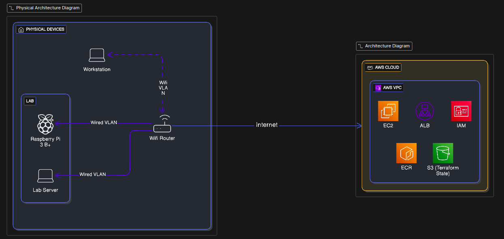

# DevOps Home Lab – Hybrid Local + AWS Architecture

## 📌 Purpose of This Home Lab

This home lab is designed to **simulate real-world DevOps and cloud engineering workflows** using limited, cost-effective hardware combined with AWS.

The goal is not to run everything in the cloud, but to:

* Practice production-style DevOps workflows
* Understand hybrid (on‑prem + cloud) architectures
* Build resume‑grade, interview‑ready projects
* Enforce automation, security, and cost awareness

---

## 🎯 Design Principles

* **Production mindset first** – every component has a reason
* **Automation over manual work**
* **Cost-aware AWS usage**
* **Failure is expected and documented**
* **Everything is reproducible and destroyable**

---

## 🧱 Hardware Inventory

### 1. Personal Laptop (Workstation)

**Role:** Control plane and development workstation

* OS: Linux (Ubuntu Desktop 22.04)
* Responsibilities:

  * Code development
  * Git and GitHub interaction
  * AWS CLI
  * Terraform execution
  * kubectl and Helm
  * Documentation and diagrams

> This machine does not host workloads.

---

### 2. Old Laptop – On‑Prem Lab Server

**Specifications**

* RAM: 8 GB
* Storage: 500 GB HDD
* OS: Ubuntu Server 22.04 LTS (bare metal)

**Role:** Core on‑prem DevOps server

**Responsibilities**

* Docker workloads
* Jenkins (self‑hosted)
* Ansible control node
* Local CI/CD execution
* Kubernetes (Kind / Minikube / Kubeadm)

---

### 3. Raspberry Pi 3 Model B+

**Role:** Edge and auxiliary node

**Recommended OS**

* Raspberry Pi OS Lite or Ubuntu Server (ARM)

**Responsibilities**

* Monitoring agents
* Lightweight services
* GitHub Actions self‑hosted runner (optional)
* Bastion / jump host experiments
* ARM vs x86 architecture comparison

---

## 🌐 Network Topology

* All devices initially operate on the same LAN
* Static IPs assigned to:

  * Old laptop (lab server)
  * Raspberry Pi
* SSH access restricted and hardened
* Internal name resolution via `/etc/hosts` (initially)

Future enhancements:

* Nginx reverse proxy
* Internal DNS service

---

## 🏗 Physical Architecture Overview



---

## 🏗 Logical Architecture Overview

```
┌──────────────────────┐
│  Personal Laptop     │
│  (Workstation)       │
│                      │
│  - Git / VS Code     │
│  - AWS CLI           │
│  - Terraform         │
│  - kubectl / Helm    │
└──────────┬───────────┘
           │ SSH / Git
           ▼
┌────────────────────────────┐
│ Old Laptop – Lab Server    │
│ Ubuntu Server 22.04        │
│                            │
│ - Docker                   │
│ - Jenkins                  │
│ - Ansible                  │
│ - Sample Applications      │
│ - K8s (Kind, Kubeadm)      │
└──────────┬─────────────────┘
           │ Metrics / SSH
           ▼
┌────────────────────────────┐
│ Raspberry Pi 3 B+          │
│                            │
│ - Monitoring Agents        │
│ - Auxiliary Services       │
│ - Edge Experiments         │
└────────────────────────────┘

           │ CI/CD / IaC
           ▼
┌────────────────────────────┐
│ AWS Cloud                  │
│                            │
│ - VPC                      │
│ - EC2                      │
│ - ALB                      │
│ - ECR                      │
│ - S3 (Terraform State)     │
└────────────────────────────┘
```

---

## ☁️ AWS Integration Strategy

AWS represents the **production simulation environment**, not the learning sandbox.

### Core AWS Services Used

* IAM – users, roles, policies
* VPC – custom networking
* EC2 – application hosting
* ALB – traffic management
* ECR – container registry
* S3 – Terraform remote state

### Workflow Example

1. Code written on personal laptop
2. Pushed to GitHub
3. Jenkins (on‑prem) builds Docker image
4. Image pushed to Amazon ECR
5. Terraform provisions AWS infrastructure
6. Application deployed to EC2 or Kubernetes

---

## 🔐 Security Practices

* No root AWS credentials stored locally
* IAM least privilege enforced
* SSH key‑based authentication only
* Secrets injected via environment variables
* Firewall rules minimized

---

## 📊 Monitoring & Observability

* Node Exporter on all nodes
* Centralized Prometheus
* Grafana dashboards
* Alerting on basic system metrics

---

## 🧪 Example Lab Scenarios Enabled

* CI/CD pipeline from on‑prem to AWS
* Terraform-driven infrastructure provisioning
* Docker image lifecycle management
* Monitoring hybrid infrastructure
* ARM vs x86 workload comparison

---

## 📈 Evolution Roadmap

**Phase 1** – Local-only lab (Docker + Jenkins)
**Phase 2** – Local CI/CD → AWS EC2 deployments
**Phase 3** – Kubernetes workloads (local → EKS)
**Phase 4** – GitOps with Argo CD

---

## ✅ Why This Home Lab Is Valuable

* Mirrors real enterprise DevOps environments
* Demonstrates hybrid architecture understanding
* Enables multiple portfolio-grade projects
* Strong talking point in interviews

---

## 📚 Documentation Standards

* All changes documented
* Architecture diagrams updated per phase
* Cleanup steps always included
* Costs reviewed after each experiment
